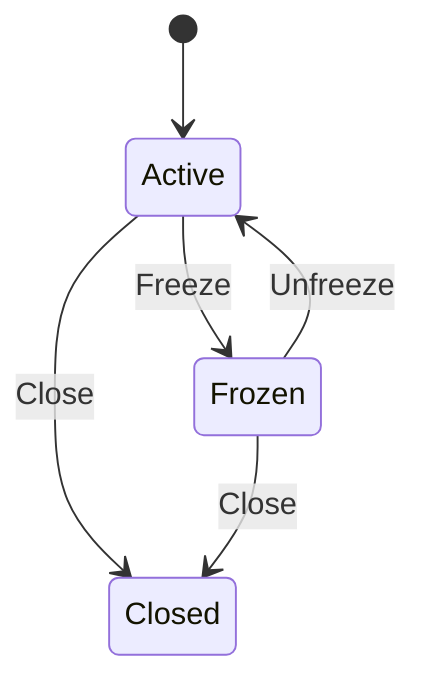

<Note>
  Customer Credits is in **Experimental** preview.
</Note>

## What is an account?

An account holds a credit balance for one customer. Think of it as a digital wallet — you create it, add credits to it, and debit from it when the customer uses them.

Most customers need just one account. But you can create multiple per customer for different purposes:

<CardGroup cols={3}>
  <Card title="loyalty_points" icon="star">
    Earned from purchases
  </Card>
  <Card title="referral_credits" icon="user-plus">
    Earned from inviting friends
  </Card>
  <Card title="promo_credits" icon="gift">
    Given during campaigns
  </Card>
</CardGroup>

## Creating accounts

Pass a `customer_id` and you're done. Everything else is optional.

```bash
curl -X POST https://api.creem.io/v1/customer-credits/accounts \
  -H "x-api-key: YOUR_API_KEY" \
  -H "Content-Type: application/json" \
  -d '{
    "customer_id": "cust_abc123",
    "name": "loyalty_points",
    "unit_label": "points",
    "initial_balance": "100"
  }'
```

```json
{
  "id": "cca_7kXmR2pQ9vN",
  "store_id": "store_xxx",
  "customer_id": "cust_abc123",
  "name": "loyalty_points",
  "unit_label": "points",
  "status": "active",
  "created_at": "2026-04-14T12:00:00.000Z",
  "updated_at": "2026-04-14T12:00:00.000Z"
}
```

### Options

| Parameter | Type | Required | Description |
| --- | --- | --- | --- |
| `customer_id` | string | ✅ | The customer this account belongs to |
| `name` | string | | A label for this account. Default: `"default"`. Unique per customer |
| `unit_label` | string | | What to call the units — "points", "gems", "credits". Default: `"credits"` |
| `initial_balance` | string | | Seed the account with credits on creation |

<Info>
  If you set `initial_balance` and the initial credit fails, the account isn't created either. No orphaned accounts.
</Info>

---

## Checking balance

One call to see what's available.

```bash
curl https://api.creem.io/v1/customer-credits/accounts/{account_id}/balance \
  -H "x-api-key: YOUR_API_KEY"
```

```json
{
  "balance": "5000",
  "updated_at": "2026-04-14T14:30:00.000Z"
}
```

### Point-in-time balance

Need to know what the balance was last Tuesday? Pass an `at` parameter.

```bash
curl "https://api.creem.io/v1/customer-credits/accounts/{account_id}/balance?at=2026-04-01T00:00:00.000Z" \
  -H "x-api-key: YOUR_API_KEY"
```

```json
{
  "balance": "3000",
  "as_of": "2026-04-01T00:00:00.000Z"
}
```

---

## Listing accounts

```bash
# All accounts in your store
curl https://api.creem.io/v1/customer-credits/accounts \
  -H "x-api-key: YOUR_API_KEY"

# For a specific customer
curl "https://api.creem.io/v1/customer-credits/accounts?customer_id=cust_abc123" \
  -H "x-api-key: YOUR_API_KEY"
```

Supports cursor-based pagination with `limit`, `starting_after`, and `ending_before`.

---

## Getting a single account

```bash
curl https://api.creem.io/v1/customer-credits/accounts/{account_id} \
  -H "x-api-key: YOUR_API_KEY"
```

---

## Account lifecycle

Accounts have three states. You can move between them as needed.



### Freeze — pause an account

Temporarily block all credits and debits. Useful for fraud review or disputes. The account stays readable.

```bash
curl -X POST https://api.creem.io/v1/customer-credits/accounts/{account_id}/freeze \
  -H "x-api-key: YOUR_API_KEY"
```

### Unfreeze — resume an account

```bash
curl -X POST https://api.creem.io/v1/customer-credits/accounts/{account_id}/unfreeze \
  -H "x-api-key: YOUR_API_KEY"
```

### Close — permanently retire an account

Balance and history stay readable forever, but no new transactions are allowed.

```bash
curl -X POST https://api.creem.io/v1/customer-credits/accounts/{account_id}/close \
  -H "x-api-key: YOUR_API_KEY"
```

<Warning>
  Closing is permanent. If you might need the account later, freeze it instead.
</Warning>

| Status | Can credit/debit? | Can read? | Use case |
| --- | --- | --- | --- |
| `active` | ✅ | ✅ | Normal operation |
| `frozen` | ❌ | ✅ | Fraud review, disputes |
| `closed` | ❌ | ✅ | Customer churned, account retired |

---

## Next steps

<CardGroup cols={2}>
  <Card title="Transactions" icon="arrow-right-arrow-left" href="/features/customer-credits/transactions">
    Credit, debit, reverse, and view history.
  </Card>
  <Card title="Recipes" icon="book-open" href="/guides/customer-credits-recipes">
    Step-by-step guides for common patterns.
  </Card>
  <Card title="API Reference" icon="code" href="/api-reference/endpoint/create-credits-account">
    Full endpoint schemas.
  </Card>
  <Card title="Introduction" icon="house" href="/features/customer-credits/introduction">
    Back to overview.
  </Card>
</CardGroup>
