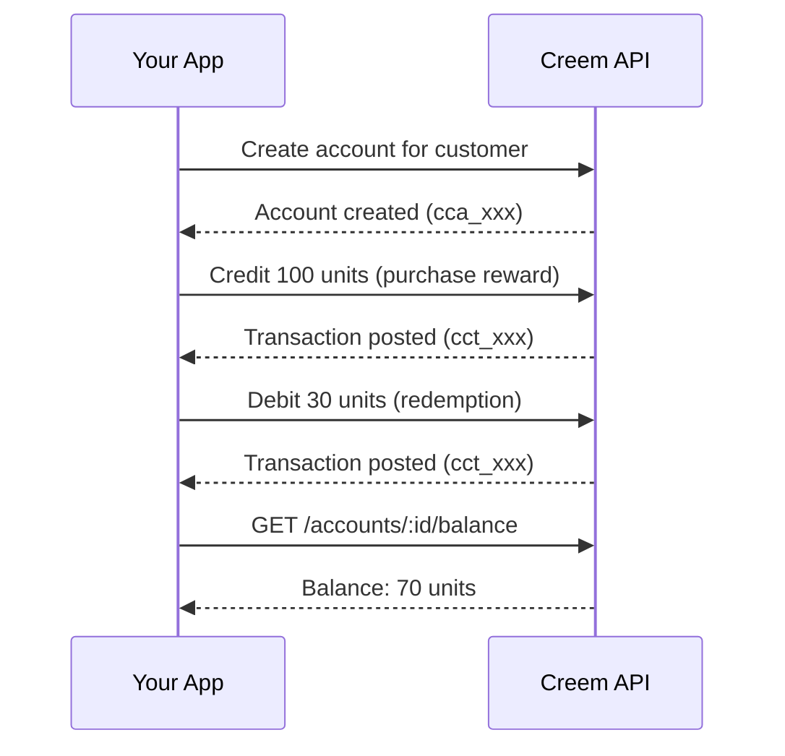

<Note>
  Customer Credits is currently in **Experimental** preview. The API is stable but may receive additive changes. All responses include the `X-API-Stability: experimental` header.
</Note>

## What is Customer Credits?

Customer Credits lets you create and manage credit balances for your customers — points, gems, tokens, coins, or any unit you want. You credit and debit through a simple API, and Creem takes care of tracking every change with a complete history.

Think of it as a hosted balance system: you define what your units are called, Creem stores and tracks them reliably. Every change is recorded, so you always have a full audit trail if you need it.

### Key Properties

| Property | Detail |
| --- | --- |
| **Unit-agnostic** | Credits, gems, stars, points, tokens — you name them, we track them |
| **Immutable history** | Every balance change is recorded permanently. Corrections are new entries, never edits to old ones |
| **BigInt amounts** | Handles any scale — amounts are strings to support arbitrarily large numbers |
| **Idempotent writes** | Every mutation requires an `idempotency_key` — safe to retry without double-counting |
| **Reference tracking** | Every transaction carries a mandatory `reference` field for linking back to your own events (orders, signups, campaigns) |

## How It Works



1. **Create an account** for each customer using their `customer_id`.
2. **Credit or debit** units via the API. Each operation is tracked as a transaction with a reference back to your system.
3. **Query balances and history** for dashboards, receipts, or reconciliation.

## Core Concepts

### Accounts

An account holds a credit balance for one customer. Each account has:

- A **name** (default: `"default"`) — useful when a customer has multiple balances (e.g., `"loyalty_points"` and `"referral_credits"`)
- A **unit label** (default: `"credits"`) — purely cosmetic, for display purposes
- A **status**: `active`, `frozen`, or `closed`

### Transactions

A transaction represents a single balance change — a credit (adding units) or a debit (removing units). Every transaction requires:

- An **`idempotency_key`** — prevents duplicate processing on retries
- A **`reference`** — your own correlation ID (e.g., `"order_12345"`, `"referral_signup_abc"`)

### Balance History

Every credit and debit is stored as an immutable entry. You can list the full history of an account at any time — useful for building transaction logs, customer-facing dashboards, or running reconciliation.

## Use Cases

<CardGroup cols={2}>
  <Card title="Loyalty & Rewards" icon="star">
    Award points on purchases, redeem for discounts or perks. Track earning and spending with a full history.
  </Card>
  <Card title="In-App Currency" icon="coins">
    Power virtual currencies — gems, tokens, coins — for games, marketplaces, or creator platforms.
  </Card>
  <Card title="Prepaid Balances" icon="wallet">
    Let customers top up a balance and draw down against it for future purchases or service usage.
  </Card>
  <Card title="Referral Credits" icon="user-plus">
    Credit referrers automatically when their invitees convert. Track the full referral-to-redemption lifecycle.
  </Card>
  <Card title="Service Usage Metering" icon="gauge">
    Allocate credit pools for API calls, compute hours, storage, or any metered resource. Debit on consumption.
  </Card>
  <Card title="Promotional Campaigns" icon="gift">
    Issue time-limited promotional credits for marketing campaigns, seasonal offers, or beta incentives.
  </Card>
  <Card title="Compensation & Goodwill" icon="hand-holding-heart">
    Issue credits for service disruptions or support escalations — tracked and auditable.
  </Card>
  <Card title="AI Wrapper Credits" icon="microchip">
    Sell credit packs for your AI product — customers buy credits, each API call deducts from their balance. No need to build billing infrastructure.
  </Card>
  <Card title="Marketplace Escrow" icon="handshake">
    Hold credits between buyer payment and seller delivery, releasing on confirmation.
  </Card>
</CardGroup>

## Quick Example

<Tabs>
  <Tab title="REST API">

<Warning>
  If you're in test mode, use `https://test-api.creem.io` instead of `https://api.creem.io`. Learn more about [Test Mode](/getting-started/test-mode).
</Warning>

```bash
# 1. Create an account
curl -X POST https://api.creem.io/v1/customer-credits/accounts \
  -H "x-api-key: YOUR_API_KEY" \
  -H "Content-Type: application/json" \
  -d '{
    "customer_id": "cust_abc123",
    "name": "loyalty_points",
    "unit_label": "points"
  }'
```

### Create Account Response

```json
{
  "id": "cca_7kXmR2pQ9vN",
  "store_id": "store_xxx",
  "customer_id": "cust_abc123",
  "name": "loyalty_points",
  "type": "liability",
  "unit_label": "points",
  "status": "active",
  "created_at": "2026-04-14T12:00:00.000Z",
  "updated_at": "2026-04-14T12:00:00.000Z"
}
```

```bash
# 2. Credit 500 points
curl -X POST https://api.creem.io/v1/customer-credits/accounts/cca_7kXmR2pQ9vN/credit \
  -H "x-api-key: YOUR_API_KEY" \
  -H "Content-Type: application/json" \
  -d '{
    "amount": "500",
    "reference": "order_789",
    "idempotency_key": "reward_order_789"
  }'
```

### Credit Response

```json
{
  "id": "cct_3mNpK8rW2xY",
  "store_id": "store_xxx",
  "reference": "order_789",
  "idempotency_key": "reward_order_789",
  "reversal_of": null,
  "entries": [
    {
      "id": "cce_2hJnR6wP5bC",
      "transaction_id": "cct_3mNpK8rW2xY",
      "account_id": "cca_7kXmR2pQ9vN",
      "side": "credit",
      "amount": "500",
      "created_at": "2026-04-14T14:30:00.000Z"
    }
  ],
  "created_at": "2026-04-14T14:30:00.000Z"
}
```

```bash
# 3. Check balance
curl https://api.creem.io/v1/customer-credits/accounts/cca_7kXmR2pQ9vN/balance \
  -H "x-api-key: YOUR_API_KEY"
```

### Balance Response

```json
{
  "balance": "500",
  "updated_at": "2026-04-14T14:30:00.000Z"
}
```

  </Tab>
</Tabs>

## Account Lifecycle

Accounts have three states:

| Status | Can transact? | Can read? | Notes |
| --- | --- | --- | --- |
| `active` | ✅ | ✅ | Default state |
| `frozen` | ❌ | ✅ | Temporarily paused — useful for fraud review or disputes |
| `closed` | ❌ | ✅ | Permanently closed. Cannot be reopened. Balance and history remain readable. |

## What's Next?

<CardGroup cols={2}>
  <Card title="Accounts" icon="user" href="/features/customer-credits/accounts">
    Create, list, freeze, and close credit accounts.
  </Card>
  <Card title="Transactions" icon="arrow-right-arrow-left" href="/features/customer-credits/transactions">
    Credit, debit, reverse, and query transactions.
  </Card>
  <Card title="Recipes" icon="book-open" href="/guides/customer-credits-recipes">
    Step-by-step guides for loyalty programs, prepaid wallets, referral credits, and more.
  </Card>
</CardGroup>
