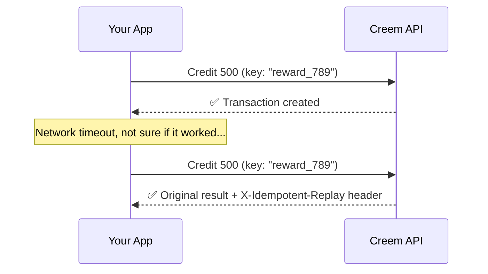

<Note>Customer Credits is in **Experimental** preview.</Note>

## How transactions work

Every time you add or remove credits, a transaction is created. Transactions are permanent — you always have a complete history of what happened and why.

<CardGroup cols={3}>
  <Card title="Credit" icon="plus">
    Add credits to an account
  </Card>
  <Card title="Debit" icon="minus">
    Remove credits from an account
  </Card>
  <Card title="Reverse" icon="rotate-left">
    Undo a previous transaction
  </Card>
</CardGroup>

---

## Credit — add credits

Use this when a customer earns credits, buys a credit pack, or receives a reward.

```bash
curl -X POST https://api.creem.io/v1/customer-credits/accounts/{account_id}/credit \
  -H "x-api-key: YOUR_API_KEY" \
  -H "Content-Type: application/json" \
  -d '{
    "amount": "500",
    "reference": "order_789",
    "idempotency_key": "reward_order_789"
  }'
```

```json
{
  "id": "cct_3mNpK8rW2xY",
  "store_id": "store_xxx",
  "reference": "order_789",
  "idempotency_key": "reward_order_789",
  "reversal_of": null,
  "entries": [
    {
      "id": "cce_2hJnR6wP5bC",
      "transaction_id": "cct_3mNpK8rW2xY",
      "account_id": "cca_7kXmR2pQ9vN",
      "side": "credit",
      "amount": "500",
      "created_at": "2026-04-14T14:30:00.000Z"
    }
  ],
  "created_at": "2026-04-14T14:30:00.000Z"
}
```

### Parameters

| Parameter         | Type   | Required | Description                                                     |
| ----------------- | ------ | -------- | --------------------------------------------------------------- |
| `amount`          | string | ✅       | How many credits to add. String to support large numbers        |
| `reference`       | string | ✅       | Link this to your system — an order ID, campaign name, anything |
| `idempotency_key` | string | ✅       | Prevents double-processing on retries                           |

---

## Debit — remove credits

Use this when a customer spends credits, uses a feature, or redeems a reward.

```bash
curl -X POST https://api.creem.io/v1/customer-credits/accounts/{account_id}/debit \
  -H "x-api-key: YOUR_API_KEY" \
  -H "Content-Type: application/json" \
  -d '{
    "amount": "200",
    "reference": "checkout_456",
    "idempotency_key": "redeem_checkout_456"
  }'
```

Same parameters as credit. The response looks identical, just with `"side": "debit"` in the entry.

<Info>
  The API prevents negative balances — if a debit would bring the balance below zero, it returns an `insufficient_balance` error. Check the balance first if you want to show your users a friendly message.
</Info>

---

## Reverse — undo a transaction

Made a mistake? Order cancelled? Reverse a transaction to undo it.

The original transaction stays in the history — a new opposite transaction is created so you always have a complete paper trail.

```bash
curl -X POST https://api.creem.io/v1/customer-credits/accounts/{account_id}/reverse \
  -H "x-api-key: YOUR_API_KEY" \
  -H "Content-Type: application/json" \
  -d '{
    "transaction_id": "cct_3mNpK8rW2xY"
  }'
```

The response includes `"reversal_of": "cct_3mNpK8rW2xY"` linking back to the original.

<Tip>
  Reversals are idempotent — reversing the same transaction twice returns the
  original reversal.
</Tip>

---

## Viewing history

See every credit and debit on an account, newest first.

```bash
curl "https://api.creem.io/v1/customer-credits/accounts/{account_id}/entries?limit=50" \
  -H "x-api-key: YOUR_API_KEY"
```

```json
{
  "object": "list",
  "data": [
    {
      "id": "cce_8dFmQ1tY4wK",
      "transaction_id": "cct_5pRsL9uZ3cB",
      "account_id": "cca_7kXmR2pQ9vN",
      "side": "debit",
      "amount": "200",
      "created_at": "2026-04-14T15:00:00.000Z"
    },
    {
      "id": "cce_2hJnR6wP5bC",
      "transaction_id": "cct_3mNpK8rW2xY",
      "account_id": "cca_7kXmR2pQ9vN",
      "side": "credit",
      "amount": "500",
      "created_at": "2026-04-14T14:30:00.000Z"
    }
  ],
  "has_more": false
}
```

Each entry shows:

- **`side`** — `"credit"` (added) or `"debit"` (removed)
- **`amount`** — how many credits
- **`transaction_id`** — links back to the transaction (which has the `reference` and `idempotency_key`)

---

## Safe retries

Every write operation requires an `idempotency_key`. This means you can safely retry any request — network timeouts, server errors, whatever — without worrying about double-crediting.



| Scenario                        | Result                                                      |
| ------------------------------- | ----------------------------------------------------------- |
| First request                   | Processes normally                                          |
| Retry with same key + same body | Returns original result, `X-Idempotent-Replay: true` header |
| Same key but different body     | `409 Conflict` error                                        |

<Tip>
  Use meaningful keys like `reward_order_789` or `topup_sub_123_2026-04` instead
  of random UUIDs. They're easier to debug and naturally prevent duplicates tied
  to the same business event.
</Tip>

---

## Next steps

<CardGroup cols={2}>
  <Card title="Accounts" icon="user" href="/features/customer-credits/accounts">
    Create, freeze, and manage accounts.
  </Card>
  <Card
    title="Recipes"
    icon="book-open"
    href="/guides/customer-credits-recipes"
  >
    Step-by-step guides for common patterns.
  </Card>
  <Card
    title="API Reference"
    icon="code"
    href="/api-reference/endpoint/credit-account"
  >
    Full endpoint schemas.
  </Card>
  <Card
    title="Introduction"
    icon="house"
    href="/features/customer-credits/introduction"
  >
    Back to overview.
  </Card>
</CardGroup>
