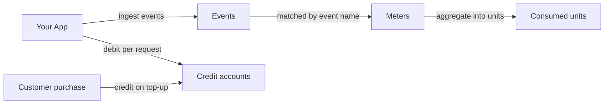

## How it fits together

Your app sends usage events to Creem, and meters total them per customer. As you serve each request, you also debit the customer's prepaid credit balance at your price.



<CardGroup cols={3}>
  <Card title="Events" icon="bolt" href="/api-reference/endpoint/ingest-usage-events">
    One customer's usage at one moment, for example 512 tokens for `cust_abc123`.
  </Card>
  <Card title="Meters" icon="gauge" href="/api-reference/endpoint/create-meter">
    Match events by name, filter them on their properties, and aggregate them with `count`, `sum`,
    `average`, `min`, `max`, or `unique`.
  </Card>
  <Card title="Credits" icon="wallet" href="/features/customer-credits/introduction">
    A prepaid balance per customer. Credit it when they buy, and debit it when they use your
    product.
  </Card>
</CardGroup>

The [CLI](/code/cli) covers the same operations under `creem events`, `creem meters`, and `creem customer-credits`.

### Units and pricing

Meters and credit accounts both count units. A meter's `unit_label` names what it counts ("tokens", "requests"), and a credit account has its own `unit_label` ("credits"). Your price is the conversion between the two, for example 1 credit per 1,000 tokens, and you apply it when you debit. The API sends amounts as strings so large counts keep full precision.

When Creem settles usage for you ([Step 5](#step-5-let-creem-settle-usage-against-credits)), the credit bucket holds **minor units of your product currency**: a €10 pack is `1000` credits, and a usage price's `unit_price` is minor units per meter unit. `unit_price` may be fractional, so a rate of €0.004 per request is `0.4`. Creem rounds the running total for the billing window to the nearest minor unit, never each request.

## Step 1: Define a meter

A meter needs a `name`, the `event_name` it counts, an `aggregation`, and a `unit_label`. Every aggregation except `count` also needs `aggregation_property`, the key in the event's `properties` to aggregate. Add filter clauses to count only some events.

<CodeGroup>

```typescript TypeScript
import { Creem } from "creem";

const creem = new Creem({ apiKey: process.env.CREEM_API_KEY! });

const meter = await creem.meters.createMeter({
  name: "Tokens used",
  eventName: "tokens_used",
  aggregation: "sum",
  aggregationProperty: "tokens",
  unitLabel: "tokens",
});
```

```bash CLI
creem meters create \
  --name "Tokens used" \
  --event-name tokens_used \
  --aggregation sum \
  --aggregation-property tokens \
  --unit-label tokens
```

```bash cURL
curl -X POST https://api.creem.io/v1/meters \
  -H "x-api-key: YOUR_API_KEY" \
  -H "Content-Type: application/json" \
  -d '{
    "name": "Tokens used",
    "event_name": "tokens_used",
    "aggregation": "sum",
    "aggregation_property": "tokens",
    "unit_label": "tokens"
  }'
```

</CodeGroup>

<Tip>
  Check a definition before you create it. `POST /v1/meters/preview` runs a meter definition against
  your recently ingested events without storing anything, and `POST /v1/meters/{id}/preview` does
  the same for an existing meter.
</Tip>

Archive a meter to stop counting with it, and unarchive it to start again. Creem keeps the raw events while a meter is archived, so unarchiving adds that usage back into any billing period still inside its late-event window.

## Step 2: Ingest events

Send up to 100 events per request. Creem validates the whole batch before storing anything. If any event is invalid, the request fails with a `422` that names the event and field (for example `events[3].customer_id`), and nothing is stored. Otherwise it returns `202`.

<CodeGroup>

```typescript TypeScript
await creem.events.ingestEvents({
  events: [
    {
      name: "tokens_used",
      customerId: "cust_abc123",
      eventId: "req_01J9X8...",
      properties: { tokens: 512, model: "gpt-4o" },
    },
  ],
});
```

```bash CLI
creem events ingest --data '{
  "events": [
    {
      "name": "tokens_used",
      "customerId": "cust_abc123",
      "eventId": "req_01J9X8...",
      "properties": { "tokens": 512, "model": "gpt-4o" }
    }
  ]
}'
```

```bash cURL
curl -X POST https://api.creem.io/v1/events/ingest \
  -H "x-api-key: YOUR_API_KEY" \
  -H "Content-Type: application/json" \
  -d '{
    "events": [
      {
        "name": "tokens_used",
        "customer_id": "cust_abc123",
        "event_id": "req_01J9X8...",
        "properties": { "tokens": 512, "model": "gpt-4o" }
      }
    ]
  }'
```

</CodeGroup>

### Identify the customer

Set exactly one of these fields on each event:

- `customer_id` is the Creem customer ID. If it doesn't belong to a customer in your store, the whole batch is rejected.
- `external_customer_id` is your own ID for the customer. Set it once as `external_id` when you [create or update the customer](/api-reference/endpoint/create-customer), then send it with events without looking up the Creem ID. External IDs are unique per store.

Both resolve to the same Creem customer, so you can switch from one to the other without splitting that customer's usage.

### Event fields

`event_id` is your idempotency key and must be unique within your store. Re-sending an `event_id` your store already accepted records nothing, so you can retry a batch after a timeout without counting it twice. If you leave `event_id` out, Creem generates a new one for every request, and a retried event is counted again.

`timestamp` is when the usage happened (ISO 8601) and defaults to the time Creem receives the event. Usage counts toward the billing period its timestamp falls in. Once that period's late-event window closes, the period is finalized: new events for it are stored but don't change its totals, and the response includes a warning.

`properties` holds the event's attributes. Meter filters and `aggregation_property` read their keys from here. It accepts up to 50 keys, keys up to 40 characters, and string or serialized-object values up to 500 characters.

### Warnings

A `202` means Creem stored the events. Whether a meter counts them shows up in the per-event warnings in the response, so a misconfigured meter surfaces on the first request instead of at the end of the month:

| Code                            | Meaning                                                                                              |
| ------------------------------- | ---------------------------------------------------------------------------------------------------- |
| `no_matching_meter`             | No meter counts this event name. The event is stored but not aggregated.                             |
| `meter_archived`                | Only archived meters match. Unarchive one to resume aggregation.                                     |
| `timestamp_outside_late_window` | The timestamp falls in a finalized billing period, so the event doesn't change that period's totals. |

## Step 3: Verify ingestion

Check that your events arrive and your meters count them:

| Endpoint                                                                           | Use it to                                                                                                                                        |
| ---------------------------------------------------------------------------------- | ------------------------------------------------------------------------------------------------------------------------------------------------ |
| [`POST /v1/events/preview`](/api-reference/endpoint/preview-usage-events)          | Dry-run an ingest payload. It returns each event's resolved `customer_id`, the meters that would count it, and any warnings, and stores nothing. |
| [`GET /v1/events`](/api-reference/endpoint/list-usage-events)                      | List stored events, filtered by customer, meter, or your `event_id` (the `reference` parameter). Each event lists the meters that matched it.    |
| [`GET /v1/meters/{id}/consumed`](/api-reference/endpoint/get-meter-consumed-units) | Read a customer's units for the current billing period. Pass `at` to get the total as of an earlier moment.                                      |

## Step 4: Charge with credits

Customers buy credits up front, and you draw the balance down as they use your product. [Customer Credits](/features/customer-credits/introduction) handles the accounts and the transaction history.

<Steps>
  <Step title="Create an account per customer">
    Call [`POST /v1/customer-credits/accounts`](/api-reference/endpoint/create-credits-account) with
    the `unit_label` your customers see, such as "credits" or "renders". Use `initial_balance` to
    include free trial credits.
  </Step>
  <Step title="Credit on purchase">
    When a customer buys a credit pack, call [`POST /v1/customer-credits/accounts/{id}
    /credit`](/api-reference/endpoint/credit-account) with your order ID as the `reference` and an
    `idempotency_key`. If your purchase webhook is retried, the same key credits the account only
    once.
  </Step>
  <Step title="Debit on each request">
    When you serve a request, call [`POST /v1/customer-credits/accounts/{id}
    /debit`](/api-reference/endpoint/debit-account) with the amount at your price. Use the request's
    `event_id` in the `reference` and `idempotency_key`, so a retried request debits only once.
  </Step>
  <Step title="Prompt the top-up">
    If the balance is too low, the debit fails with `422` and the error code `insufficient_balance`,
    and nothing is debited. To warn customers earlier, listen for the [`credits.consumed`
    webhook](/code/webhooks). Each one carries `balance_after_minor_units`, the balance left after
    the debit.
  </Step>
</Steps>

Debit with the same ID you sent as `event_id`, so the event and the debit point at the same request:

```typescript TypeScript
// 1 credit per 1,000 tokens, rounded up
const credits = (BigInt(tokens) + 999n) / 1000n;

await creem.customerCredits.debitAccount("cca_...", {
  amount: credits.toString(),
  reference: eventId,
  idempotencyKey: `debit-${eventId}`,
});
```

## Step 5: Let Creem settle usage against credits

Instead of debiting on every request yourself, attach the meter to a product as a **prepaid usage price**. Subscribers to that product are then debited automatically as their usage aggregates: units past the free allowance are multiplied by the unit price and drawn from the credit bucket the price names. You keep ingesting events; Creem does the settlement.

Both the metered product and the credit top-up that funds it can be created from the API:

```bash
# A recurring plan with a metered charge on top of its base price
curl -X POST https://api.creem.io/v1/products \
  -H "x-api-key: creem_your_api_key" \
  -H "Content-Type: application/json" \
  -d '{
    "name": "Pro plan",
    "description": "Base fee plus per-image usage",
    "price": 1000,
    "currency": "EUR",
    "billing_type": "recurring",
    "billing_period": "every-month",
    "usage_prices": [
      {
        "meter_id": "mtr_...",
        "unit_price": 2,
        "free_allowance": 100,
        "settlement_mode": "prepaid",
        "target_account": "per_unit"
      }
    ]
  }'
```

```bash
# A one-time top-up whose purchase grants 500 credits into that bucket
curl -X POST https://api.creem.io/v1/products \
  -H "x-api-key: creem_your_api_key" \
  -H "Content-Type: application/json" \
  -d '{
    "name": "500 image credits",
    "description": "Top up your image balance",
    "price": 500,
    "currency": "EUR",
    "billing_type": "onetime",
    "features": [
      {
        "type": "customerCredits",
        "description": "500 image credits",
        "customer_credits": { "amount": "500", "unit_label": "images", "bucket_name": "images" }
      }
    ]
  }'
```

| Field                            | Description                                                                                                                                                                                                                                                                                                                                      |
| -------------------------------- | ------------------------------------------------------------------------------------------------------------------------------------------------------------------------------------------------------------------------------------------------------------------------------------------------------------------------------------------------ |
| `usage_prices[].meter_id`        | The meter this charge bills. One charge per meter per product; recurring products only.                                                                                                                                                                                                                                                          |
| `usage_prices[].unit_price`      | Tax-exclusive price per **single** meter unit, in minor units of the product currency. Fractional values are normal: "$20 per 1,000,000 tokens" is `0.002`, €0.004 per tile is `0.4`. Creem multiplies by the units consumed in the billing window and rounds the running total to the nearest minor unit, so sub-cent rates accumulate exactly. |
| `usage_prices[].free_allowance`  | Units per billing period, per customer, before the charge applies. Defaults to `0`.                                                                                                                                                                                                                                                              |
| `usage_prices[].settlement_mode` | `prepaid` debits the customer's credit account as usage aggregates.                                                                                                                                                                                                                                                                              |
| `usage_prices[].target_account`  | `shared` (the customer's default wallet) or `per_unit` (a bucket named after the meter's unit label, or `target_account_name`).                                                                                                                                                                                                                  |
| `features[].customer_credits`    | The grant a purchase makes: `amount` (as a string, in minor units of the product currency, so a €10 pack grants `"1000"`), an optional `unit_label`, and the `bucket_name` it funds. Point it at the same bucket the usage price debits.                                                                                                         |

On update, `usage_prices` and `features` are the product's complete set: omit them to leave charges and credit features untouched, send `[]` to remove them, include an `id` to edit one in place. `GET /v1/products/{id}` echoes both, so you can read back what you attached. Settlement emits `credits.consumed` per billing window; when the bucket cannot cover a charge, `customer_credits.exhausted` fires once per episode, and a customer who has consented to auto-refill is charged for the top-up product on their saved card.

## Worked example: pay-as-you-go API with a prepaid wallet

You run a map API. A vector tile costs €0.004 and a geocoding lookup costs €0.04. Customers prepay: a €10 monthly plan includes €10 of usage, and they can buy €25 top-up packs. Creem meters both operations and draws the cost from one wallet.

<Steps>
  <Step title="One meter per operation">
    Meter what happened, not what it costs. Each operation gets a `count` meter with its own unit label, so the rate can change later without touching your events.

    ```bash
    curl -X POST https://api.creem.io/v1/meters \
      -H "x-api-key: creem_your_api_key" \
      -H "Content-Type: application/json" \
      -d '{ "name": "Tiles served", "event_name": "tile_served", "aggregation": "count", "unit_label": "tiles" }'

    curl -X POST https://api.creem.io/v1/meters \
      -H "x-api-key: creem_your_api_key" \
      -H "Content-Type: application/json" \
      -d '{ "name": "Geocoding lookups", "event_name": "geocode", "aggregation": "count", "unit_label": "lookups" }'
    ```

    If you batch usage before sending it, for example one event per customer per hour, use `sum` over a `count` property instead of `count`, and put the batch total in `properties.count`.

  </Step>
  <Step title="A plan that carries the rates and includes credits">
    The plan's base price is €10 a month. Its credits feature grants `1000` credits into the customer's default wallet each time the subscription is paid, which is €10 at one credit per cent. Its two usage prices name the meters and the rates in minor units per unit: `0.4` for a tile, `4` for a lookup.

    ```bash
    curl -X POST https://api.creem.io/v1/products \
      -H "x-api-key: creem_your_api_key" \
      -H "Content-Type: application/json" \
      -d '{
        "name": "Maps API",
        "description": "€10 of usage included every month, pay as you go beyond it",
        "price": 1000,
        "currency": "EUR",
        "billing_type": "recurring",
        "billing_period": "every-month",
        "features": [
          {
            "type": "customerCredits",
            "description": "€10 of usage included every month",
            "customer_credits": { "amount": "1000", "unit_label": "credits", "bucket_name": "default" }
          }
        ],
        "usage_prices": [
          { "meter_id": "mtr_tiles", "unit_price": 0.4, "settlement_mode": "prepaid", "target_account": "shared" },
          { "meter_id": "mtr_geocoding", "unit_price": 4, "settlement_mode": "prepaid", "target_account": "shared" }
        ]
      }'
    ```

    The dashboard quotes these rates per 1,000 units: "€0.40 per 1,000 tiles" and "€40.00 per 1,000 lookups".

  </Step>
  <Step title="A top-up pack">
    A one-time product whose only job is to fund the same wallet. Its `amount` equals its price in minor units.

    ```bash
    curl -X POST https://api.creem.io/v1/products \
      -H "x-api-key: creem_your_api_key" \
      -H "Content-Type: application/json" \
      -d '{
        "name": "€25 usage top-up",
        "description": "Adds €25 of usage to your wallet",
        "price": 2500,
        "currency": "EUR",
        "billing_type": "onetime",
        "features": [
          {
            "type": "customerCredits",
            "description": "€25 of usage",
            "customer_credits": { "amount": "2500", "unit_label": "credits", "bucket_name": "default" }
          }
        ]
      }'
    ```

  </Step>
  <Step title="Send events and let Creem settle">
    Ingest `tile_served` and `geocode` events with the customer's id. Each meter totals them per customer per calendar month, and every time a total changes Creem recomputes the charge for that month and debits the difference.

    | Tiles served this month | Charge so far      | Debited this time |
    | ----------------------- | ------------------ | ----------------- |
    | 1,234                   | 493.6 → 494 credits | 494               |
    | 1,250                   | 500 credits        | 6                 |
    | 4,000                   | 1,600 credits      | 1,100             |

    Each debit shows up as a `credits.consumed` webhook with the balance after it.

  </Step>
</Steps>

### When the wallet runs out

A charge the wallet cannot cover is refused, the customer gets an email, and you receive `customer_credits.exhausted` once, with the shortfall. Nothing is lost: the charge is the running total for the month, so the next event in that month collects everything outstanding. A top-up on its own does not trigger a settlement, so usage at the very end of a month with no later event stays uncollected until an event arrives. Customers who opt in to [auto-refill](/features/customer-credits/auto-refill) have the top-up pack re-purchased for them.

### Things to know

- **Windows are calendar months (UTC).** Every meter totals usage per customer per calendar month, independent of the subscription's billing date, and settlement charges the difference each time a month's total changes.
- **Paused subscriptions are not settled.** Metering continues while a subscription is paused, and the accumulated charge is collected when it is active again. Pausing is not a way to keep debiting while skipping the monthly fee.
- **Usage prices need a live subscription.** Customers who only buy packs fund the wallet but are not debited automatically. Debit them through the [credits API](/features/customer-credits/transactions) yourself until a plan without a base fee is available.
- **Use `free_allowance`** on a usage price for units per month that should not be charged at all, and `cap` to bound a customer's monthly usage charge.

## API key scopes

Usage endpoints need scoped API keys. Give each key only the scopes its job needs. An ingestion worker, for example, needs only `events:write`.

| Scope          | Grants                                                 |
| -------------- | ------------------------------------------------------ |
| `events:write` | Ingest and preview events                              |
| `events:read`  | List stored events                                     |
| `meters:write` | Create, update, preview, archive, and unarchive meters |
| `meters:read`  | List meters, read consumed units                       |
