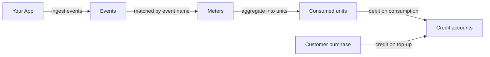

## How it fits together

Usage-based billing on Creem is a pipeline of three building blocks:



<CardGroup cols={3}>
  <Card title="Events" icon="bolt" href="/api-reference/endpoint/ingest-usage-events">
    Immutable facts about consumption: *this customer used 512 tokens at this
    time*. Sent in batches, deduplicated by your own event ids.
  </Card>
  <Card title="Meters" icon="gauge" href="/api-reference/endpoint/create-meter">
    Standing queries over events: match an event name, optionally filter on
    attributes, and aggregate — count, sum, average, min, max, or unique.
  </Card>
  <Card title="Credits" icon="wallet" href="/features/customer-credits/introduction">
    Prepaid balances per customer. Sell credit packs, debit as usage settles,
    and get a webhook when a balance runs out.
  </Card>
</CardGroup>

### A word on units

Every number in this pipeline is a **unit count, not a currency amount**. A
meter aggregates events into units labeled by its `unit_label` ("tokens",
"requests", "GB-hours"), and a credit account holds credits labeled by *its*
`unit_label`. Pricing is the exchange rate you choose between the two — for
example, "1 credit per 1,000 tokens" — applied when you debit. Amounts are
strings end to end so large counts never lose precision.

## Step 1 — Define a meter

A meter names the event it consumes (`event_name`), how to aggregate
(`aggregation`), and — for everything except `count` — which event attribute to
aggregate over (`aggregation_property`, resolved from the event's
`properties`). Optional filter clauses restrict which events count.

<CodeGroup>

```typescript TypeScript
import { Creem } from "creem";

const creem = new Creem({ apiKey: process.env.CREEM_API_KEY! });

const meter = await creem.meters.createMeter({
  name: "Tokens used",
  eventName: "tokens_used",
  aggregation: "sum",
  aggregationProperty: "tokens",
  unitLabel: "tokens",
});
```

```bash CLI
creem meters create \
  --name "Tokens used" \
  --event-name tokens_used \
  --aggregation sum \
  --aggregation-property tokens \
  --unit-label tokens
```

```bash cURL
curl -X POST https://api.creem.io/v1/meters \
  -H "x-api-key: YOUR_API_KEY" \
  -H "Content-Type: application/json" \
  -d '{
    "name": "Tokens used",
    "event_name": "tokens_used",
    "aggregation": "sum",
    "aggregation_property": "tokens",
    "unit_label": "tokens"
  }'
```

</CodeGroup>

<Tip>
  Not sure the definition is right? `POST /v1/meters/preview` runs a meter
  definition against your recently ingested events **without creating
  anything**, and `POST /v1/meters/{id}/preview` does the same for a stored
  meter. Preview first, create when the numbers look right.
</Tip>

Meters can be **archived** when you stop billing on them and **unarchived** to
resume — raw events are always retained, so unarchiving folds usage from any
still-open billing period back in.

## Step 2 — Ingest events

Send events in batches of up to 100. Validation is all-or-nothing: either the
whole batch is accepted with a `202`, or a `422` tells you exactly which event
and field to fix (`events[3].customer_id`) and nothing is stored.

<CodeGroup>

```typescript TypeScript
await creem.events.ingestEvents({
  events: [
    {
      name: "tokens_used",
      customerId: "cust_abc123",
      eventId: "req_01J9X8...",
      properties: { tokens: 512, model: "gpt-4o" },
    },
  ],
});
```

```bash CLI
creem events ingest --data '{
  "events": [
    {
      "name": "tokens_used",
      "customerId": "cust_abc123",
      "eventId": "req_01J9X8...",
      "properties": { "tokens": 512, "model": "gpt-4o" }
    }
  ]
}'
```

```bash cURL
curl -X POST https://api.creem.io/v1/events/ingest \
  -H "x-api-key: YOUR_API_KEY" \
  -H "Content-Type: application/json" \
  -d '{
    "events": [
      {
        "name": "tokens_used",
        "customer_id": "cust_abc123",
        "event_id": "req_01J9X8...",
        "properties": { "tokens": 512, "model": "gpt-4o" }
      }
    ]
  }'
```

</CodeGroup>

### Who used it — two ways to say

Each event carries **exactly one** of:

- `customer_id` — the Creem customer id. It must belong to an existing
  customer of your store, or the whole batch is rejected.
- `external_customer_id` — **your own id** for the customer. Register it once
  as `external_id` on the [customers API](/api-reference/endpoint/create-customer)
  (unique per store), then ingest with the id your systems already know —
  no lookup round-trip.

Either way, usage is attributed to the resolved Creem customer, so switching
between the two later never splits a customer's usage history.

### Retries, timestamps, and the one bag

- **`event_id`** is your idempotency key, unique within your store. Re-sending
  the same `event_id` is a no-op, so retrying a failed batch is always safe.
  Omit it and Creem generates one — supply your own if you want retry safety.
- **`timestamp`** is when the usage happened, on your clock (ISO 8601);
  it defaults to ingestion time. Billing attributes usage to the supplied
  timestamp, bounded by a late-event window — once a billing period
  finalizes, late events no longer change its totals (you'll get a warning
  instead, see below).
- **`properties`** is the event's one attribute bag. Meter filters and
  aggregation properties resolve their keys here, unprefixed. Limits: at most
  50 keys, keys up to 40 characters, string and serialized-object values up
  to 500 characters.

### Warnings: accepted is not the same as billed

A `202` means the events are stored — not that any meter consumed them. The
response carries per-event **warnings** so misconfiguration surfaces on the
first request instead of at the end of the month:

| Code | Meaning |
| --- | --- |
| `no_matching_meter` | No meter consumes this event name — the event is stored but aggregates nothing. |
| `meter_archived` | Only archived meters match; unarchive one to resume aggregation. |
| `timestamp_outside_late_window` | The billing period this timestamp falls in is finalized — the event will never change its totals. |

## Step 3 — Verify before you trust it

<CardGroup cols={3}>
  <Card title="Dry-run a batch" icon="flask" href="/api-reference/endpoint/preview-usage-events">
    `POST /v1/events/preview` takes the exact ingest payload and reports, per
    event, the resolved `customer_id`, which meters would consume it, and any
    warnings — without storing anything.
  </Card>
  <Card title="Inspect stored events" icon="list" href="/api-reference/endpoint/list-usage-events">
    `GET /v1/events` lists what you ingested, filterable by customer, meter,
    or your own `event_id` reference — each event annotated with the meters
    that matched it.
  </Card>
  <Card title="Read the totals" icon="calculator" href="/api-reference/endpoint/get-meter-consumed-units">
    `GET /v1/meters/{id}/consumed` returns a customer's aggregated units for
    the current billing period — with `?at=` to replay the total as of any
    past moment.
  </Card>
</CardGroup>

## Step 4 — Charge for it with credits

The prepaid pattern: customers buy credits up front, and consumption draws the
balance down. [Customer Credits](/features/customer-credits/introduction)
provides the accounts, the transaction history, and the exhaustion webhook.

<Steps>
  <Step title="Create an account per customer">
    Pick the `unit_label` your customers think in — "credits", "tokens",
    "renders". Optionally seed it with `initial_balance` (free trial credits).
  </Step>
  <Step title="Credit on purchase">
    When a customer buys a credit pack, `POST .../credit` with your order id
    as the `reference` and an `idempotency_key` so a retried webhook can never
    double-credit.
  </Step>
  <Step title="Debit on consumption">
    Read consumed units from the meter (or debit inline as you serve the
    request) and `POST .../debit` at your chosen exchange rate — same
    `reference` + `idempotency_key` discipline.
  </Step>
  <Step title="Prompt the top-up">
    Subscribe to the credits webhooks — you're notified when a balance is
    exhausted, so you can prompt a top-up instead of failing the customer's
    next request.
  </Step>
</Steps>

```typescript TypeScript
// 1,000 tokens = 1 credit — your exchange rate, applied at debit time
const consumed = await creem.meters.getConsumedUnits("mtr_...", "cust_abc123");
const creditsUsed = Math.ceil(Number(consumed.units) / 1000);

await creem.customerCredits.debitAccount("acct_...", {
  amount: String(creditsUsed),
  reference: `billing-${consumed.periodStart}`,
  idempotencyKey: `debit-${consumed.periodStart}-cust_abc123`,
});
```

## API key scopes

Usage endpoints use scoped API keys. Create a key with exactly the scopes the
workload needs — an ingestion worker only ever needs `events:write`:

| Scope | Grants |
| --- | --- |
| `events:write` | Ingest and preview events |
| `events:read` | List stored events |
| `meters:write` | Create, update, preview, archive meters |
| `meters:read` | List meters, read consumed units |

## Reference

<CardGroup cols={2}>
  <Card title="Events API" icon="bolt" href="/api-reference/endpoint/ingest-usage-events">
    Ingest, preview, and list usage events.
  </Card>
  <Card title="Meters API" icon="gauge" href="/api-reference/endpoint/create-meter">
    Full meter lifecycle: create, preview, update, consumed units, archive.
  </Card>
  <Card title="Customer Credits" icon="wallet" href="/features/customer-credits/introduction">
    Accounts, transactions, and balance webhooks.
  </Card>
  <Card title="CLI" icon="terminal" href="/code/cli">
    `creem events`, `creem meters`, and `creem customer-credits` commands.
  </Card>
</CardGroup>
