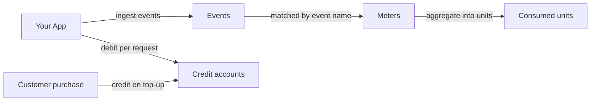

## How it fits together

Your app sends usage events to Creem, and meters total them per customer. As you serve each request, you also debit the customer's prepaid credit balance at your price.



<CardGroup cols={3}>
  <Card title="Events" icon="bolt" href="/api-reference/endpoint/ingest-usage-events">
    One customer's usage at one moment, for example 512 tokens for
    `cust_abc123`.
  </Card>
  <Card title="Meters" icon="gauge" href="/api-reference/endpoint/create-meter">
    Match events by name, filter them on their properties, and aggregate them
    with `count`, `sum`, `average`, `min`, `max`, or `unique`.
  </Card>
  <Card title="Credits" icon="wallet" href="/features/customer-credits/introduction">
    A prepaid balance per customer. Credit it when they buy, and debit it when
    they use your product.
  </Card>
</CardGroup>

The [CLI](/code/cli) covers the same operations under `creem events`, `creem meters`, and `creem customer-credits`.

### Units and pricing

Meters and credit accounts both count units. A meter's `unit_label` names what it counts ("tokens", "requests"), and a credit account has its own `unit_label` ("credits"). Your price is the conversion between the two, for example 1 credit per 1,000 tokens, and you apply it when you debit. The API sends amounts as strings so large counts keep full precision.

## Step 1: Define a meter

A meter needs a `name`, the `event_name` it counts, an `aggregation`, and a `unit_label`. Every aggregation except `count` also needs `aggregation_property`, the key in the event's `properties` to aggregate. Add filter clauses to count only some events.

<CodeGroup>

```typescript TypeScript
import { Creem } from "creem";

const creem = new Creem({ apiKey: process.env.CREEM_API_KEY! });

const meter = await creem.meters.createMeter({
  name: "Tokens used",
  eventName: "tokens_used",
  aggregation: "sum",
  aggregationProperty: "tokens",
  unitLabel: "tokens",
});
```

```bash CLI
creem meters create \
  --name "Tokens used" \
  --event-name tokens_used \
  --aggregation sum \
  --aggregation-property tokens \
  --unit-label tokens
```

```bash cURL
curl -X POST https://api.creem.io/v1/meters \
  -H "x-api-key: YOUR_API_KEY" \
  -H "Content-Type: application/json" \
  -d '{
    "name": "Tokens used",
    "event_name": "tokens_used",
    "aggregation": "sum",
    "aggregation_property": "tokens",
    "unit_label": "tokens"
  }'
```

</CodeGroup>

<Tip>
  Check a definition before you create it. `POST /v1/meters/preview` runs a
  meter definition against your recently ingested events without storing
  anything, and `POST /v1/meters/{id}/preview` does the same for an existing
  meter.
</Tip>

Archive a meter to stop counting with it, and unarchive it to start again. Creem keeps the raw events while a meter is archived, so unarchiving adds that usage back into any billing period still inside its late-event window.

## Step 2: Ingest events

Send up to 100 events per request. Creem validates the whole batch before storing anything. If any event is invalid, the request fails with a `422` that names the event and field (for example `events[3].customer_id`), and nothing is stored. Otherwise it returns `202`.

<CodeGroup>

```typescript TypeScript
await creem.events.ingestEvents({
  events: [
    {
      name: "tokens_used",
      customerId: "cust_abc123",
      eventId: "req_01J9X8...",
      properties: { tokens: 512, model: "gpt-4o" },
    },
  ],
});
```

```bash CLI
creem events ingest --data '{
  "events": [
    {
      "name": "tokens_used",
      "customerId": "cust_abc123",
      "eventId": "req_01J9X8...",
      "properties": { "tokens": 512, "model": "gpt-4o" }
    }
  ]
}'
```

```bash cURL
curl -X POST https://api.creem.io/v1/events/ingest \
  -H "x-api-key: YOUR_API_KEY" \
  -H "Content-Type: application/json" \
  -d '{
    "events": [
      {
        "name": "tokens_used",
        "customer_id": "cust_abc123",
        "event_id": "req_01J9X8...",
        "properties": { "tokens": 512, "model": "gpt-4o" }
      }
    ]
  }'
```

</CodeGroup>

### Identify the customer

Set exactly one of these fields on each event:

- `customer_id` is the Creem customer ID. If it doesn't belong to a customer in your store, the whole batch is rejected.
- `external_customer_id` is your own ID for the customer. Set it once as `external_id` when you [create or update the customer](/api-reference/endpoint/create-customer), then send it with events without looking up the Creem ID. External IDs are unique per store.

Both resolve to the same Creem customer, so you can switch from one to the other without splitting that customer's usage.

### Event fields

`event_id` is your idempotency key and must be unique within your store. Re-sending an `event_id` your store already accepted records nothing, so you can retry a batch after a timeout without counting it twice. If you leave `event_id` out, Creem generates a new one for every request, and a retried event is counted again.

`timestamp` is when the usage happened (ISO 8601) and defaults to the time Creem receives the event. Usage counts toward the billing period its timestamp falls in. Once that period's late-event window closes, the period is finalized: new events for it are stored but don't change its totals, and the response includes a warning.

`properties` holds the event's attributes. Meter filters and `aggregation_property` read their keys from here. It accepts up to 50 keys, keys up to 40 characters, and string or serialized-object values up to 500 characters.

### Warnings

A `202` means Creem stored the events. Whether a meter counts them shows up in the per-event warnings in the response, so a misconfigured meter surfaces on the first request instead of at the end of the month:

| Code | Meaning |
| --- | --- |
| `no_matching_meter` | No meter counts this event name. The event is stored but not aggregated. |
| `meter_archived` | Only archived meters match. Unarchive one to resume aggregation. |
| `timestamp_outside_late_window` | The timestamp falls in a finalized billing period, so the event doesn't change that period's totals. |

## Step 3: Verify ingestion

Check that your events arrive and your meters count them:

| Endpoint | Use it to |
| --- | --- |
| [`POST /v1/events/preview`](/api-reference/endpoint/preview-usage-events) | Dry-run an ingest payload. It returns each event's resolved `customer_id`, the meters that would count it, and any warnings, and stores nothing. |
| [`GET /v1/events`](/api-reference/endpoint/list-usage-events) | List stored events, filtered by customer, meter, or your `event_id` (the `reference` parameter). Each event lists the meters that matched it. |
| [`GET /v1/meters/{id}/consumed`](/api-reference/endpoint/get-meter-consumed-units) | Read a customer's units for the current billing period. Pass `at` to get the total as of an earlier moment. |

## Step 4: Charge with credits

Customers buy credits up front, and you draw the balance down as they use your product. [Customer Credits](/features/customer-credits/introduction) handles the accounts and the transaction history.

<Steps>
  <Step title="Create an account per customer">
    Call [`POST /v1/customer-credits/accounts`](/api-reference/endpoint/create-credits-account)
    with the `unit_label` your customers see, such as "credits" or "renders".
    Use `initial_balance` to include free trial credits.
  </Step>
  <Step title="Credit on purchase">
    When a customer buys a credit pack, call
    [`POST /v1/customer-credits/accounts/{id}/credit`](/api-reference/endpoint/credit-account)
    with your order ID as the `reference` and an `idempotency_key`. If your
    purchase webhook is retried, the same key credits the account only once.
  </Step>
  <Step title="Debit on each request">
    When you serve a request, call
    [`POST /v1/customer-credits/accounts/{id}/debit`](/api-reference/endpoint/debit-account)
    with the amount at your price. Use the request's `event_id` in the
    `reference` and `idempotency_key`, so a retried request debits only once.
  </Step>
  <Step title="Prompt the top-up">
    If the balance is too low, the debit fails with `422` and the error code
    `insufficient_balance`, and nothing is debited. To warn customers earlier,
    listen for the [`credits.consumed` webhook](/code/webhooks). Each one
    carries `balance_after_minor_units`, the balance left after the debit.
  </Step>
</Steps>

Debit with the same ID you sent as `event_id`, so the event and the debit point at the same request:

```typescript TypeScript
// 1 credit per 1,000 tokens, rounded up
const credits = (BigInt(tokens) + 999n) / 1000n;

await creem.customerCredits.debitAccount("cca_...", {
  amount: credits.toString(),
  reference: eventId,
  idempotencyKey: `debit-${eventId}`,
});
```

## API key scopes

Usage endpoints need scoped API keys. Give each key only the scopes its job needs. An ingestion worker, for example, needs only `events:write`.

| Scope | Grants |
| --- | --- |
| `events:write` | Ingest and preview events |
| `events:read` | List stored events |
| `meters:write` | Create, update, preview, archive, and unarchive meters |
| `meters:read` | List meters, read consumed units |
