# Creem Framer Plugin

A Framer plugin to add Creem checkout buttons and pricing tables to your site. No custom code needed.

[Tutorial](https://dev.to/armitage-labs/how-to-add-payment-buttons-pricing-tables-to-your-framer-website-no-code-required-267) · [Creem docs](https://docs.creem.io) · [Report a bug](https://github.com/armitage-labs/creem/issues)


## What it does

- Browse your Creem products and insert components into Framer
- Add a **checkout button** for a single product
- Add a **pricing table** with one-time and subscription products in the same table
- Open checkout in an **embed modal** or a **new tab**
- Use **test mode** before going live

## Setup

### 1. Run the plugin locally

From the monorepo root:

```bash
pnpm install
pnpm --filter @creem_io/framer dev
```

Or from this package:

```bash
cd packages/framer
pnpm dev
```

### 2. Load it in Framer

1. Open Framer
2. Open your project → **Canvas** → **Plugins**
3. Click the **Open Development Plugin** button

### 3. Connect Creem

1. Copy your API key from [Creem Dashboard](https://www.creem.io/dashboard/developers) → Developers → API Keys
2. Open the plugin in Framer
3. Paste the key and turn on **Use Test Mode** if you are testing

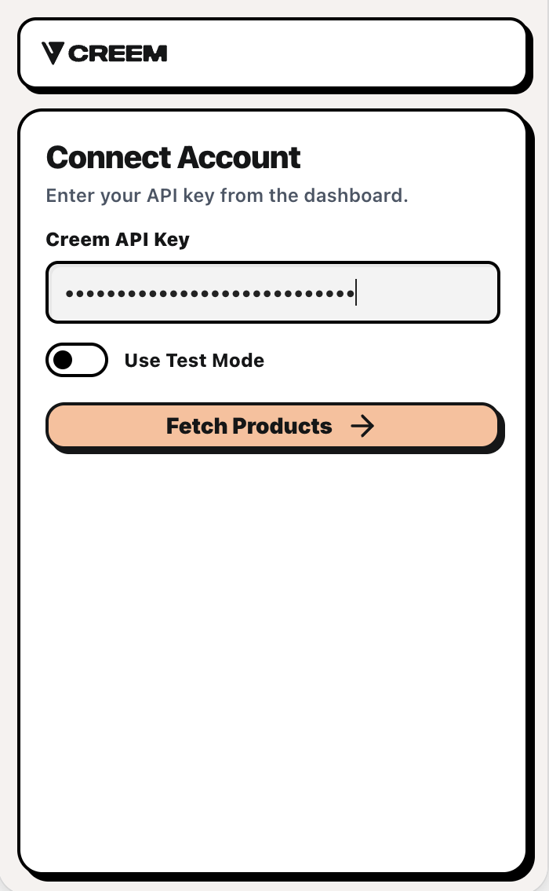

## How to use

### Browse products

After connecting, you land on the **Products** screen. Search products, refresh the list, or toggle **Show archived products**. Use **Insert Button** or **Insert Pricing Table** at the bottom to start inserting.

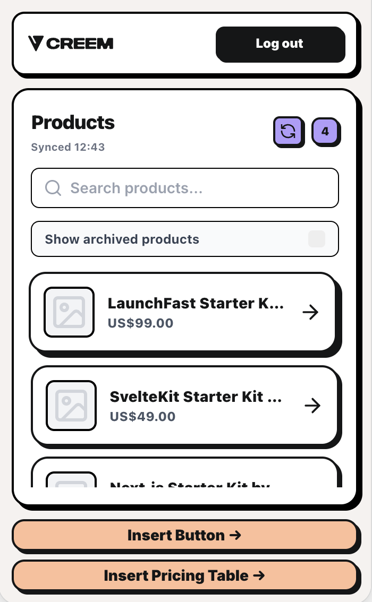

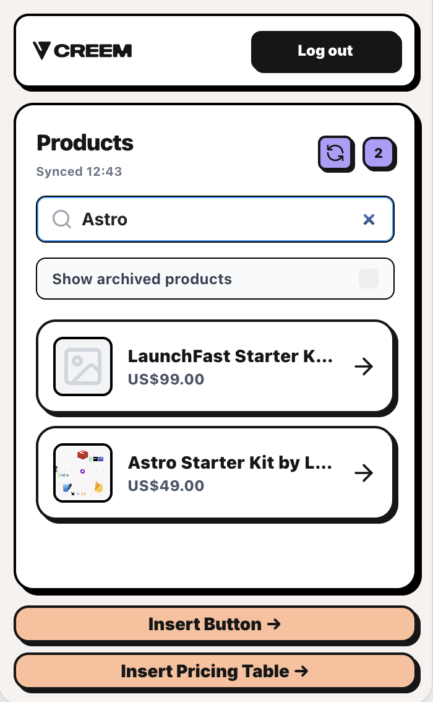

### Checkout type

Both the checkout button and pricing table let you choose how checkout opens:

| Option      | What happens                                       |
| ----------- | -------------------------------------------------- |
| **Embed**   | Opens checkout on the same page in a modal overlay |
| **New Tab** | Opens checkout in a new browser tab                |

### Product types and billing

The plugin supports all Creem product types. Prices show the correct label for each (for example, one-time products have no billing suffix).

**Product types**

| Type             | Description                                 |
| ---------------- | ------------------------------------------- |
| **One-time**     | A single purchase with no recurring billing |
| **Subscription** | Recurring billing on a set schedule         |

**Subscription billing frequencies**

| Frequency    | How it appears |
| ------------ | -------------- |
| **Monthly**  | `/month`       |
| **3 Months** | `/3 months`    |
| **6 Months** | `/6 months`    |
| **Yearly**   | `/year`        |
| **Daily**    | `/day`         |

In a pricing table, you can mix one-time and subscription products in the same table. If you have monthly and yearly versions of the same plan (for example, "Pro - Monthly" and "Pro - Yearly"), the plugin pairs them and shows a monthly/yearly toggle on that tier.

### Checkout button

Choose **Button** at the top, then pick a product, checkout type, button text, and accent color.

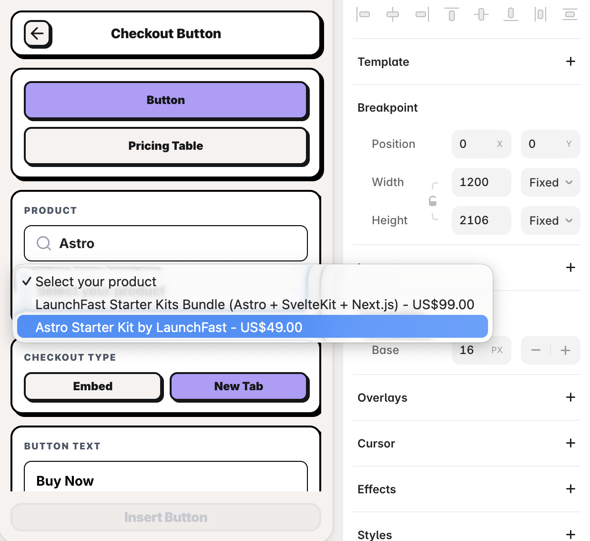

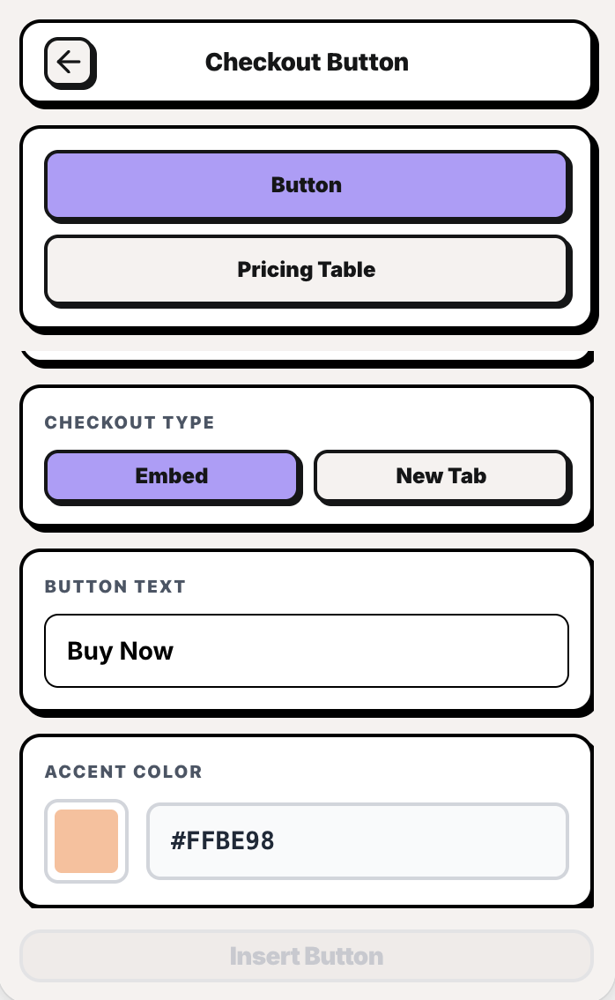

1. Pick a product (search supported)
2. Choose **Embed** or **New Tab** for checkout
3. Set **Button Text** and **Accent Color**
4. Click **Insert Button**

### Pricing table

Choose **Pricing Table** at the top. Set the heading, subheading, layout, and columns, then select products. You can mix one-time and subscription products in the same table.

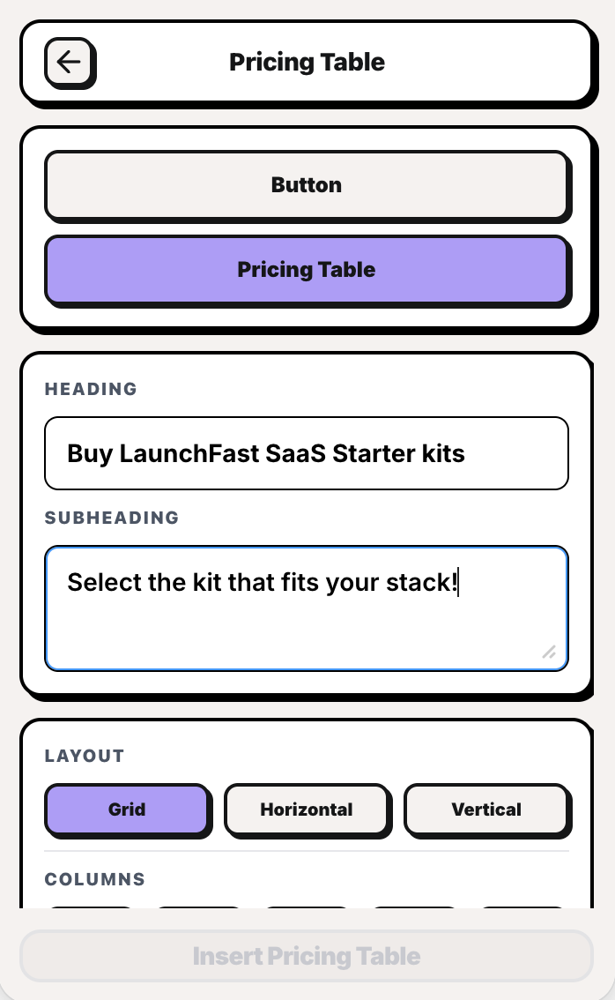

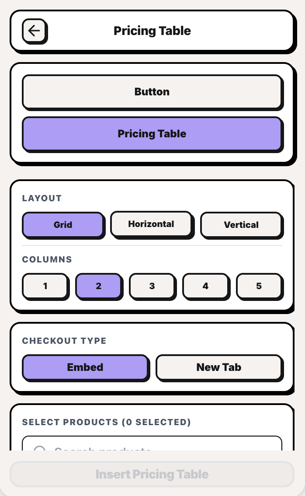

Select products (search supported). One-time, subscription, and monthly/yearly pairs can appear in the same list.

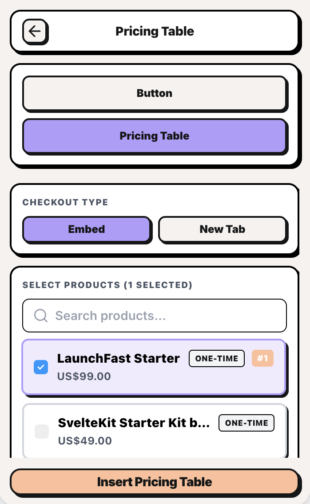

Expand **Edit Tiers** to customize each product. The first tier opens by default.

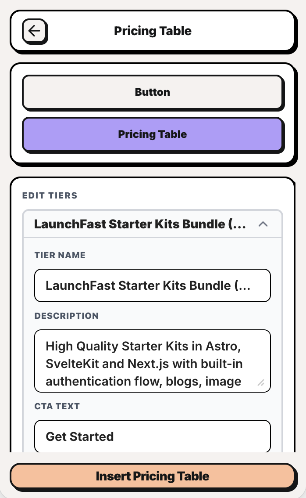

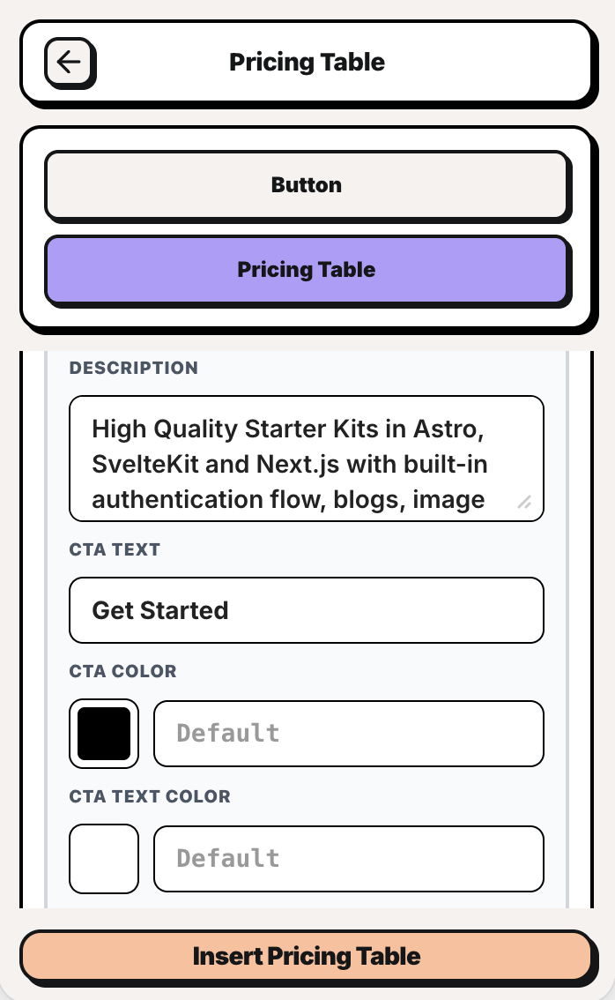

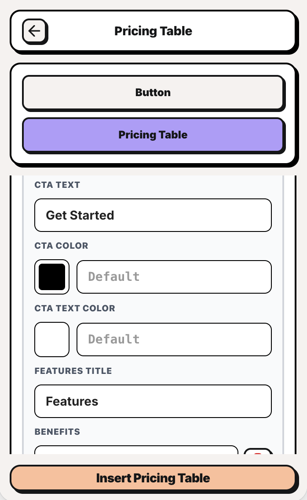

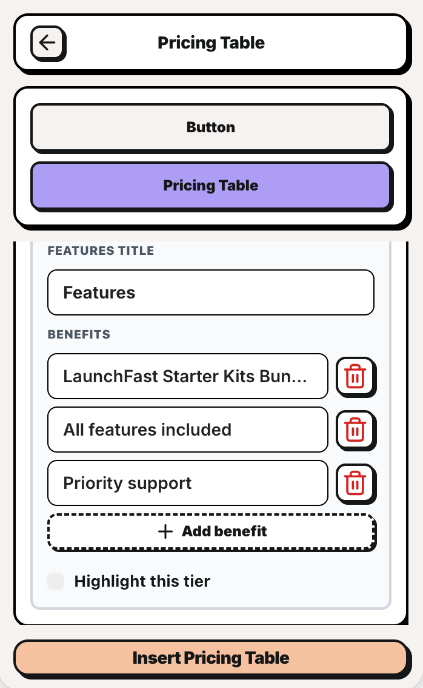

Turn on **Highlight this tier** to feature a plan. It uses your accent color for the card border, button, and a stronger shadow so that tier stands out on the page.

1. Set **Heading** and **Subheading**
2. Pick a **Layout** (Grid, Horizontal, or Vertical) and number of **Columns** (if layout is **Grid**)
3. Choose **Embed** or **New Tab**
4. Select products and reorder them if needed
5. Edit tier names, descriptions, CTA text, colors, and benefits
6. Check **Highlight this tier** on the plan you want to feature
7. Click **Insert Pricing Table**
8. Tweak layout and fonts in Framer's property panel

## License

Licensed under the [MIT license](LICENSE).

Contributors: Heet Bhalodiya, Rishi Raj Jain
